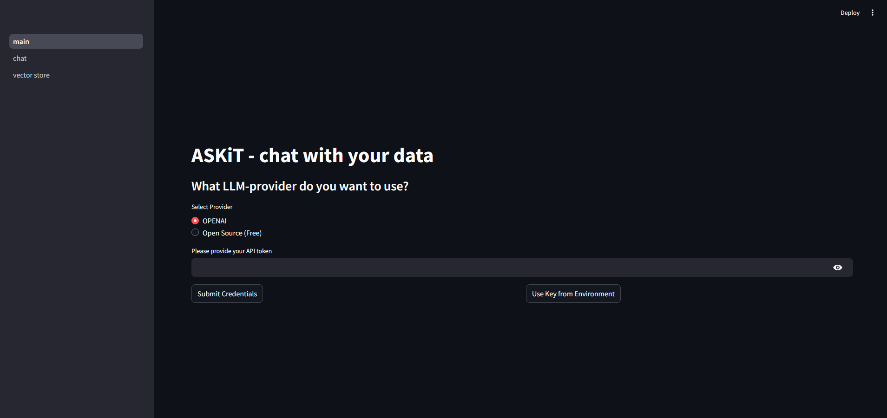
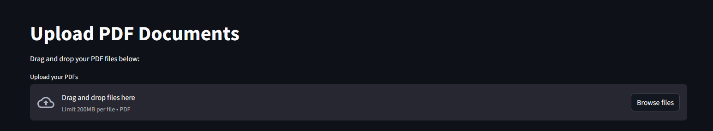
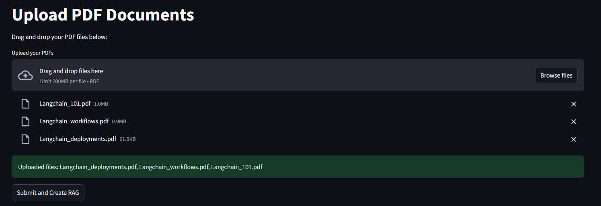
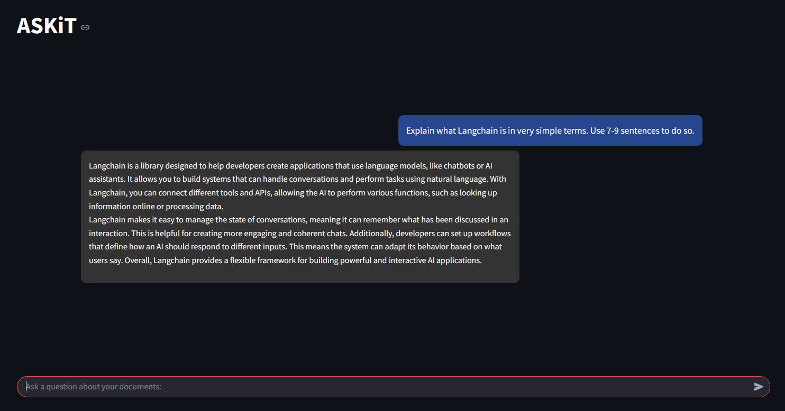
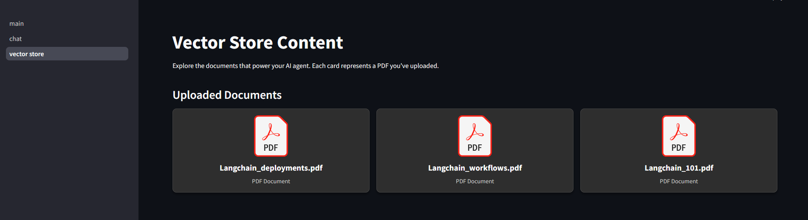

# ASKiT: Chat with Your Data

ASKiT is a Retrieval-Augmented Generation (RAG) chat application that leverages LangChain, vector stores, and large language models to create a conversational interface powered by your uploaded documents. This project uses Streamlit for the front-end, providing an intuitive UI for uploading documents, creating a knowledge base, and interacting with an AI-powered chat agent.

## Table of Contents

- [Features](#features)
- [Installation](#installation)
- [Usage](#usage)
- [Folder Structure](#folder-structure)
- [Screenshots](#screenshots)
- [Contributing](#contributing)
- [License](#license)

## Features

- **RAG Chat Interface:** Ask questions about your uploaded documents.
- **Document Ingestion:** Upload PDF documents to build a vector store as your knowledge base.
- **Dynamic Chat UI:** Dark-themed chat interface with streaming AI responses.
- **Vector Store Explorer:** A gallery page to view all uploaded PDFs.

## Installation

1. **Clone the Repository:**

   ```bash
   git clone https://github.com/yourusername/ASKiT.git
   cd ASKiT
   ```
2. **Create a Virtual Environment:**
   ```bash
    python -m venv venv
    source venv/bin/activate  # On Windows: venv\Scripts\activate
   ```
3. **Install Dependencies:**
   ```bash
   pip install -r requirements.txt
   ```
4. **Set Up Environment Variables (Optional):**
You can add your API key to an .env file under the name 'API_KEY'.


## Usage

1. **Run the Application:**
From the project root, run:
   ```bash
   streamlit run main.py
   ```
2. **Workflow:**

Below are screenshots that illustrate the key components and workflow of the ASKiT application. All images are stored in the `docs/` folder.

### 1. Login Page  
**ASKiT-login.png**  
This screenshot shows the login page when opening the Streamlit application. Here, you select the LLM provider, enter your API key manually, or choose to "collect key from environment" for convenience during development.



### 2. Upload PDF Files  
**ASKiT-upload.png**  
This screenshot demonstrates the interface where you can drag and drop your PDF files. It’s the first step towards building your knowledge base.



### 3. Submit Documents  
**ASKiT-submit.png**  
After uploading your PDF files, this screenshot shows where you press "Submit and Create RAG" to process the files and create the vector store.



### 4. Chat Interface  
**ASKiT-chat.png**  
This screenshot shows the chat interface where you interact with the AI agent using your uploaded documents as context. The interface features a dark theme and streaming AI responses.



### 5. Vector Store Explorer  
**ASKiT-vectorstore.png**  
This screenshot displays the Vector Store Explorer page, which shows a gallery of your uploaded PDF documents. This helps you verify the content that the AI agent has access to.


